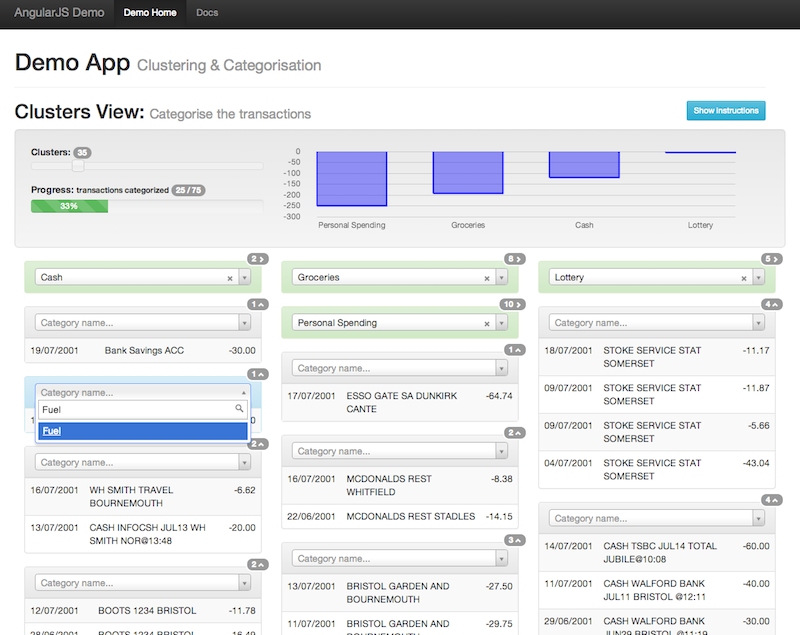

# AngularJS Demonstration App

Single-page AngularJS application providing an example of:
  - integraton of multiple JavaScript libraries (jQueryUI, Masonry, Select2, Flot and Bootstrap) 
  - simple, custom clustering functionality

*Jump to:* 
  - [Documentation (GitHub Pages)](http://enrobsop.github.io/angularjs-categorizor-demo)
  - **[Live Demo](http://enrobsop.github.io/angularjs-categorizor-demo/demo.html)**

### Screenshot

